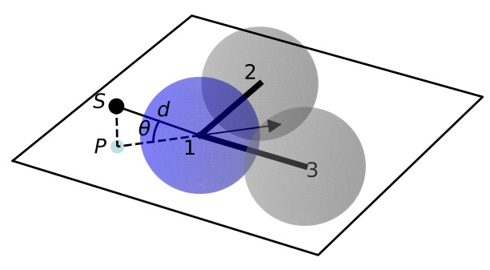

# The SMIRks Native Open Force Field (SMIRNOFF) specification v0.2

SMIRNOFF is a specification for encoding molecular mechanics force fields from the [Open Force Field Initiative](http://openforcefield.org) based on direct chemical perception using the broadly-supported [SMARTS](http://www.daylight.com/dayhtml/doc/theory/theory.smarts.html) language, utilizing atom tagging extensions from [SMIRKS](http://www.daylight.com/dayhtml/doc/theory/theory.smirks.html).

## Authors and acknowledgments

The SMIRNOFF specification was designed by the [Open Force Field Initiative](http://openforcefield.org).

Primary contributors include:
* Caitlin C. Bannan (University of California, Irvine) `<bannanc@uci.edu>`
* Christopher I. Bayly (OpenEye Software) `<bayly@eyesopen.com>`
* John D. Chodera  (Memorial Sloan Kettering Cancer Center) `<john.chodera@choderalab.org>`
* David L. Mobley (University of California, Irvine) `<dmobley@uci.edu>`

SMIRNOFF and its reference implementation in the `openforcefield` toolkit was heavily inspired by the [ForceField class](http://docs.openmm.org/latest/api-python/generated/simtk.openmm.app.forcefield.ForceField.html#simtk.openmm.app.forcefield.ForceField) from the [OpenMM](http://openmm.org) molecular simulation package, and its associated [XML format](http://docs.openmm.org/latest/userguide/application.html#writing-the-xml-file), developed by [Peter K. Eastman](https://en.wikipedia.org/wiki/Peter_Eastman) (Stanford University).

## Representations and encodings

A force field in the SMIRNOFF format can be encoded in multiple representations.
Currently, only an [XML](https://en.wikipedia.org/wiki/XML) representation is supported by the reference implementation of the [openforcefield toolkit](http://github.com/openforcefield/openforcefield).

### XML representation

A SMIRNOFF force field can be described in an [XML](https://en.wikipedia.org/wiki/XML) representation, which provides a human- and machine-readable form for encoding the parameter set and its typing rules.
This document focuses on describing the XML representation of the force field.

* By convention, XML-encoded SMIRNOFF force fields use an `.offxml` extension if written to a file to prevent confusion with other file formats.
* In XML, numeric quantities appear as strings, like `"1"` or `"2.3"`.
* Integers should always be written without a decimal point, such as `"1"`, `"9"`.
* Non-integral numbers, such as parameter values, should be written with a decimal point, such as `"1.23"`, `"2."`.
* In XML, certain special characters that occur in valid SMARTS/SMIRKS patterns (such as ampersand symbols `&`) must be specially encoded.
See [this list of XML and HTML character entity references](https://en.wikipedia.org/wiki/List_of_XML_and_HTML_character_entity_references) for more details.

### Future representations: JSON, MessagePack, YAML, and TOML

We are considering supporting [JSON](https://www.json.org/), [MessagePack](https://msgpack.org/index.html), [YAML](http://yaml.org/), and [TOML](https://github.com/toml-lang/toml) representations as well.

## Reference implementation

A reference implementation of the SMIRNOFF XML specification is provided in the [openforcefield toolkit](http://github.com/openforcefield/openforcefield).

## Support for molecular simulation packages

The reference implementation currently generates parameterized molecular mechanics systems for the GPU-accelerated [OpenMM](http://openmm.org) molecular simulation toolkit.
Parameterized systems can subsequently be converted for use in other popular molecular dynamics simulation packages (including [AMBER](http://ambermd.org/), [CHARMM](https://www.charmm.org), [NAMD](http://www.ks.uiuc.edu/Research/namd/), [Desmond](https://www.deshawresearch.com/resources_desmond.html), and [LAMMPS](http://lammps.sandia.gov/)) via [ParmEd](http://parmed.github.io/ParmEd) and [InterMol](https://github.com/shirtsgroup/InterMol).
See [Converting SMIRNOFF parameterized systems to other simulation packages](https://open-forcefield-toolkit.readthedocs.io/en/latest/converting.html) for more details.

## Basic structure

A reference implementation of a SMIRNOFF force field parser that can process XML representations (denoted by `.offxml` file extensions) can be found in the `ForceField` class of the `openforcefield.typing.engines.smirnoff` module.

Below, we describe the main structure of such an XML representation.

### The enclosing `<SMIRNOFF>` tag

A SMIRNOFF forcefield XML specification always is enclosed in a `<SMIRNOFF>` tag, with certain required attributes provided.
```XML
<SMIRNOFF version="0.2" aromaticity_model="OEAroModel_MDL">
...
</SMIRNOFF>
```

#### Versioning

The SMIRNOFF force field format supports versioning via the `version` attribute to the root `<SMIRNOFF>` tag, e.g.:
```XML
<SMIRNOFF version="0.2" aromaticity_model="OEAroModel_MDL">
...
</SMIRNOFF>
```
The version format is `x.y`, where `x` denotes the major version and `y` denotes the minor version.
SMIRNOFF versions are guaranteed to be backward-compatible within the *same major version number series*, but it is possible major version increments will break backwards-compatibility.

#### Aromaticity model

The `aromaticity_model` specifies the aromaticity model used for chemical perception (here, `OEAroModel_MDL`).

Currently, the only supported model is `OEAroModel_MDL`, which is implemented in both the RDKit and the OpenEye Toolkit.

.. note :: Add link to complete open specification of `OEAroModel_MDL` aromaticity model.

### Metadata

Typically, date and author information is included:
```XML
<Date>2016-05-25</Date>
<Author>J. D. Chodera (MSKCC) charge increment tests</Author>
```
The `<Date>` tag should conform to [ISO 8601 date formatting guidelines](https://en.wikipedia.org/wiki/ISO_8601), such as `2018-07-14` or `2018-07-14T08:50:48+00:00` (UTC time).

.. todo :: Should we have a separate `<Metadata>` or `<Provenance>` section that users can add whatever they want to? This would minimize the potential for accidentally colliding with other tags we add in the future.

### Parameter generators

Within the `<SMIRNOFF>` tag, top-level tags encode parameters for a force field based on a SMARTS/SMIRKS-based specification describing the chemical environment the parameters are to be applied to.
The file has tags corresponding to OpenMM force terms (`Bonds`, `Angles`, `TorsionForce`, etc., as discussed in more detail below); these specify units used for the different constants provided for individual force terms.
```XML
<Angles angle_unit="degrees" k_unit="kilocalories_per_mole/radian**2">
   ...
</Angles>     
```
which introduces following `Angle` terms which will use units of degrees for the angle and kilocalories per mole per square radian for the force constant.

### Specifying parameters

Under each of these force terms, there are tags for individual parameter lines such as these:
```XML
<Angles angle_unit="degrees" k_unit="kilocalories_per_mole/radian**2">
   <Angle smirks="[a,A:1]-[#6X4:2]-[a,A:3]" angle="109.50" k="100.0"/>
   <Angle smirks="[#1:1]-[#6X4:2]-[#1:3]" angle="109.50" k="70.0"/>
</Angles>     
```
The first of these specifies the `smirks` attribute as `[a,A:1]-[#6X4:2]-[a,A:3]`, specifying a SMIRKS pattern that matches three connected atoms specifying an angle.
This particular SMIRKS pattern matches a tetravalent carbon at the center with single bonds to two atoms of any type.
This pattern is essentially a [SMARTS](http://www.daylight.com/dayhtml/doc/theory/theory.smarts.html) string with numerical atom tags commonly used in [SMIRKS](http://www.daylight.com/dayhtml/doc/theory/theory.smirks.html) to identify atoms in chemically unique environments---these can be thought of as tagged regular expressions for identifying chemical environments, and atoms within those environments.
Here, `[a,A]` denotes any atom---either aromatic (`a`) or aliphatic (`A`), while `[#6X4]` denotes a carbon by element number (`#6`) that with four substituents (`X4`).
The symbol `-` joining these groups denotes a single bond.
The strings `:1`, `:2`, and `:2` label these atoms as indices 1, 2, and 3, with 2 being the central atom.
Equilibrium angles are provided as the `angle` attribute, along with force constants as the `k` attribute (with corresponding units as given above by `angle_unit` and `k_unit`, respectively).

.. note ::

   The XML parser ignores attributes in the XML that it does not know how to process.
   For example, providing an `<Angle>` tag that also specifies a second force constant `k2` will simply result in `k2` being silently ignored.

### SMIRNOFF parameter specification is hierarchical

Parameters that appear later in a SMIRNOFF specification override those which come earlier if they match the same pattern.
This can be seen in the example above, where the first line provides a generic angle parameter for any tetravalent carbon (single bond) angle, and the second line overrides this for the specific case of a hydrogen-(tetravalent carbon)-hydrogen angle.
This hierarchical structure means that a typical parameter file will tend to have generic parameters early in the section for each force type, with more specialized parameters assigned later.

### Multiple SMIRNOFF representations can be processed in sequence

Multiple SMIRNOFF `.offxml` files can be loaded by the openforcefield `ForceField` in sequence.
If these files each contain unique top-level tags (such as `<Bonds>`, `<Angles>`, etc.), the resulting forcefield will be independent of the order in which the files are loaded.
If, however, the same tag occurs in multiple files, the contents of the tags are merged, with the tags read later taking precedence over the parameters read earlier, provided the top-level tags have compatible attributes.
The resulting force field will therefore depend on the order in which parameters are read.

This behavior is intended for limited use in appending very specific parameters, such as parameters specifying solvent models, to override standard parameters.

## Units

To minimize the potential for [unit conversion errors](https://en.wikipedia.org/wiki/Mars_Climate_Orbiter#Cause_of_failure), SMIRNOFF forcefields explicitly specify units in a form readable to both humans and computers for all unit-bearing quantities.
Allowed values for units are given in [simtk.unit](https://github.com/pandegroup/openmm/blob/topology/wrappers/python/simtk/unit/unit_definitions.py).
For example, for the `angle` (equilibrium angle) and `k` (force constant) parameters in the `<Angles>` example block above, the `angle_unit` and `k_unit` top-level attributes specify the corresponding units:
```XML
<Angles angle_unit="degrees" k_unit="kilocalories_per_mole/radian**2">
...
</Angles>  
```
For more information, see the [standard OpenMM unit system](http://docs.openmm.org/latest/userguide/theory.html#units).

## SMIRNOFF independently applies parameters to each class of potential energy terms

The SMIRNOFF uses direct chemical perception to assign parameters for potential energy terms independently for each term.
Rather than first applying atom typing rules and then looking up combinations of the resulting atom types for each force term, the rules for directly applying parameters to atoms is compartmentalized in separate sections.
The file consists of multiple top-level tags defining individual components of the potential energy (in addition to charge models or modifiers), with each section specifying the typing rules used to assign parameters for that potential term:
```XML
<Bonds potential="harmonic" length_unit="angstroms" k_unit="kilocalories_per_mole/angstrom**2">
   <Bond smirks="[#6X4:1]-[#6X4:2]" length="1.526" k="620.0"/>
   <Bond smirks="[#6X4:1]-[#1:2]" length="1.090" k="680.0"/>
   ...
</Bonds>

<Angles potential="harmonic" angle_unit="degrees" k_unit="kilocalories_per_mole/radian**2">
   <Angle smirks="[a,A:1]-[#6X4:2]-[a,A:3]" angle="109.50" k="100.0"/>
   <Angle smirks="[#1:1]-[#6X4:2]-[#1:3]" angle="109.50" k="70.0"/>
   ...
</Angles>
```
Each top-level tag specifying a class of potential energy terms has an attribute `potential` for specifying the functional form for the interaction.
Common defaults are defined, but the goal is to eventually allow these to be overridden by alternative choices or even algebraic expressions in the future, once more molecular simulation packages support general expressions.
We distinguish between functional forms available in all common molecular simulation packages (specified by keywords) and support for general functional forms available in a few packages (especially OpenMM, which supports a flexible set of custom forces defined by algebraic expressions) with an **EXPERIMENTAL** label.

Many of the specific forces are implemented as discussed in the [OpenMM Documentation](http://docs.openmm.org/latest/userguide/theory.html); see especially [Section 19 on Standard Forces](http://docs.openmm.org/latest/userguide/theory.html#standard-forces) for mathematical descriptions of these functional forms.
Some top-level tags provide attributes that modify the functional form used to be consistent with packages such as AMBER or CHARMM.

## Partial charge and electrostatics models

SMIRNOFF supports several approaches to specifying electrostatic models.
Currently, only classical fixed point charge models are supported, but future extensions to the specification will support point multipoles, point polarizable dipoles, Drude oscillators, charge equilibration methods, and so on.

### `<LibraryCharges>`: Library charges for polymeric residues and special solvent models

.. warning:: This functionality is not yet implemented and will appear in a future version of the toolkit

A mechanism is provided for specifying library charges that can be applied to molecules or residues that match provided templates.
Library charges are applied first, and atoms for which library charges are applied will be excluded from alternative charging schemes listed below.

For example, to assign partial charges for a non-terminal ALA residue from the [AMBER ff14SB](http://doi.org/10.1021/acs.jctc.5b00255) parameter set:
```XML
<LibraryCharges charge_unit="elementary_charge">
   <!-- match a non-terminal alanine residue with AMBER ff14SB partial charges-->
   <LibraryCharge name="ALA" smirks="[NX3:1]([#1:2])([#6])[#6H1:3]([#1:4])([#6:5]([#1:6])([#1:7])[#1:8])[#6:9](=[#8:10])[#7]" charge1="-0.4157" charge2="0.2719" charge3="0.0337" charge4="0.0823" charge5="-0.1825" charge6="0.0603" charge7="0.0603" charge8="0.0603" charge9="0.5973" charge10="-0.5679">
   ...
</LibraryCharges>
```
In this case, a SMIRKS string defining the residue tags each atom that should receive a partial charge, with the charges specified by attributes `charge1`, `charge2`, etc.
The `name` attribute is optional.
Note that, for a given template, chemically equivalent atoms should be assigned the same charge to avoid undefined behavior.
If the template matches multiple non-overlapping sets of atoms, all such matches will be assigned the provided charges.
If multiple templates match the same set of atoms, the last template specified will be used.

Solvent models or excipients can also have partial charges specified via the `<LibraryCharges>` tag.
For example, to ensure water molecules are assigned partial charges for [TIP3P](http://www.sklogwiki.org/SklogWiki/index.php/TIP3P_model_of_water) water, we can specify a library charge entry:
```XML
<LibraryCharges charge_unit="elementary_charge">
   <!-- TIP3P water oxygen with charge override -->
   <LibraryCharge name="TIP3P" smirks="[#1:1]-[#8X2H2+0:2]-[#1:3]" charge1="+0.417" charge2="-0.834" charge3="+0.417"/>
</LibraryCharges>
```

### `<ChargeIncrementModel>`: Small molecule and fragment charges

.. warning:: This functionality is not yet implemented and will appear in a future version of the toolkit. This area of the SMIRNOFF spec is under further consideration. Please see Issue 208 on the Open Force Field Toolkit issue tracker (https://github.com/openforcefield/openforcefield/issues/208).

In keeping with the AMBER force field philosophy, especially as implemented in small molecule force fields such as [GAFF](http://ambermd.org/antechamber/gaff.html), [GAFF2](https://mulan.swmed.edu/group/gaff.php), and [parm@Frosst](http://www.ccl.net/cca/data/parm_at_Frosst/), partial charges for small molecules are usually assigned using a quantum chemical method (usually a semiempirical method such as [AM1](https://en.wikipedia.org/wiki/Austin_Model_1)) and a [partial charge determination scheme](https://en.wikipedia.org/wiki/Partial_charge) (such as [CM2](http://doi.org/10.1021/jp972682r) or [RESP](http://doi.org/10.1021/ja00074a030)), then subsequently corrected via charge increment rules, as in the highly successful [AM1-BCC](https://dx.doi.org/10.1002/jcc.10128) approach.

Here is an example:
```XML
<ChargeIncrementModel number_of_conformers="10" quantum_chemical_method="AM1" partial_charge_method="CM2" increment_unit="elementary_charge">
  <!-- A fractional charge can be moved along a single bond -->
  <ChargeIncrement smirks="[#6X4:1]-[#6X3a:2]" chargeincrement1="-0.0073" chargeincrement2="+0.0073"/>
  <ChargeIncrement smirks="[#6X4:1]-[#6X3a:2]-[#7]" chargeincrement1="+0.0943" chargeincrement2="-0.0943"/>
  <ChargeIncrement smirks="[#6X4:1]-[#8:2]" chargeincrement1="-0.0718" chargeincrement2="+0.0718"/>
  <!--- Alternatively, factional charges can be redistributed among any number of bonded atoms -->
  <ChargeIncrement smirks="[N:1](H:2)(H:3)" chargeincrement1="+0.02" chargeincrement2="-0.01" chargeincrement3="-0.01"/>
</ChargeIncrementModel>
```
The sum of formal charges for the molecule or fragment will be used to determine the total charge the molecule or fragment will possess.

`<ChargeIncrementModel>` provides several optional attributes to control its behavior:
* The `number_of_conformers` attribute (default: `"10"`) is used to specify how many conformers will be generated for the molecule (or capped fragment) prior to charging.
* The `quantum_chemical_method` attribute (default: `"AM1"`) is used to specify the quantum chemical method applied to the molecule or capped fragment.
* The `partial_charge_method` attribute (default: `"CM2"`) is used to specify how uncorrected partial charges are to be generated from the quantum chemical wavefunction. Later additions will add restrained electrostatic potential fitting (RESP) capabilities.   

The `<ChargeIncrement>` tags specify how the quantum chemical derived charges are to be corrected to produce the final charges.
The `chargeincrement#` attributes specify how much the charge on the associated tagged atom index (replacing `#`) should be modified.
The sum of charge increments should equal zero.

Note that atoms for which library charges have already been applied are excluded from charging via `<ChargeIncrementModel>`.

Future additions will provide options for intelligently fragmenting large molecules and biopolymers, as well as a `capping` attribute to specify how fragments with dangling bonds are to be capped to allow these groups to be charged.

### `<ToolkitAM1BCC>`: Temporary support for toolkit-based AM1-BCC partial charges

.. warning:: Until `<ChargeIncrementModel>` is implemented, support for the `<ToolkitAM1BCC>` tag has been enabled in the toolkit. This tag is not permanent and may be phased out in future versions of the spec.

This tag calculates partial charges using the default settings of the highest-priority cheminformatics toolkit that can perform [AM1-BCC charge assignment](https://docs.eyesopen.com/toolkits/python/quacpactk/molchargetheory.html#am1bcc-charges).
Currently, if the OpenEye toolkit is licensed and available, this will use QuacPac configured to generate charges using [AM1-BCC ELF10](https://docs.eyesopen.com/toolkits/python/quacpactk/OEProtonClasses/OEAM1BCCELF10Charges.html) for each unique molecule in the topology.
Otherwise RDKit will be used for initial conformer generation and the AmberTools antechamber/sqm software will be used for charge calculation.

Conformer generation is performed regardless of whether conformations of the input molecule were provided.
If RDKit/AmberTools are used as the toolkit backend for this calculation, only the first conformer is used.

Due to the implementation differences between these toolkits, the charges generated by this tag may differ.

Note that atoms for which library charges have already been applied are excluded from charging via `<ToolkitAM1BCC>`.


### Prespecified charges (reference implementation only)

In our reference implementation of SMIRNOFF in the `openforcefield` toolkit, we also provide a method for specifying user-defined partial charges during system creation.
This functionality is accessed by using the `charge_from_molecules` optional argument during system creation, such as in  `ForceField.create_openmm_system(topology, charge_from_molecules=molecule_list)`. When this optional keyword is provided, all matching molecules will have their charges set by the entries in `molecule_list`.
This method is provided solely for convenience in developing and exploring alternative charging schemes; actual force field releases for distribution will use one of the other mechanisms specified above.

## Parameter sections

A SMIRNOFF force field consists of one or more force field term definition sections.
For the most part, these sections independently define how a specific component of the potential energy function for a molecular system is supposed to be computed (such as bond stretch energies, or Lennard-Jones interactions), as well as how parameters are to be assigned for this particular term.
This decoupling of how parameters are assigned for each term provides a great deal of flexibility in composing new force fields while allowing a minimal number of parameters to be used to achieve accurate modeling of intramolecular forces.

Below, we describe the specification for each force field term definition using the XML representation of a SMIRNOFF force field.

As an example of a complete SMIRNOFF force field specification, see the prototype [SMIRNOFF99Frosst offxml](https://github.com/openforcefield/openforcefield/blob/master/openforcefield/data/test_forcefields/smirnoff99Frosst.offxml).

.. note :: Not all parameter sections *must* be specified in a SMIRNOFF force field. A wide variety of force field terms are provided in the specification, but a particular force field only needs to define a subset of those terms.

### `<vdW>`

van der Waals force parameters, which include repulsive forces arising from Pauli exclusion and attractive forces arising from dispersion, are specified via the `<vdW>` tag with sub-tags for individual `Atom` entries, such as:
```XML
<vdW potential="Lennard-Jones-12-6" combining_rules="Lorentz-Berthelot" scale12="0.0" scale13="0.0" scale14="0.5" scale15="1.0" sigma_unit="angstroms" epsilon_unit="kilocalories_per_mole" switch_width="8.0" switch_width_unit="angstrom" cutoff="9.0" cutoff_unit="angstroms" long_range_dispersion="isotropic">
   <Atom smirks="[#1:1]" sigma="1.4870" epsilon="0.0157"/>
   <Atom smirks="[#1:1]-[#6]" sigma="1.4870" epsilon="0.0157"/>
   ...
</vdW>
```
For standard Lennard-Jones 12-6 potentials (specified via `potential="Lennard-Jones-12-6"`), the `epsilon` parameter denotes the well depth, while the size property can be specified either via providing the `sigma` attribute, such as `sigma="1.3"`, or via the `r_0/2` (`rmin/2`) values used in AMBER force fields (here denoted `rmin_half` as in the example above).
The two are related by `r0 = 2^(1/6)*sigma` and conversion is done internally in `ForceField` into the `sigma` values used in OpenMM.
Note that, if `rmin_half` is specified instead of `sigma`, `rmin_half_unit` should be specified; both can be used in the same block if desired.

Attributes in the `<vdW>` tag specify the scaling terms applied to the energies of 1-2 (`scale12`, default: 0), 1-3 (`scale13`, default: 0), 1-4 (`scale14`, default: 0.5), and 1-5 (`scale15`, default: 1.0) interactions,
as well as the distance at which a switching function is applied (`switch_width`, default: `"1.0"` angstroms), the cutoff (`cutoff`, default: `"9.0"` angstroms), and long-range dispersion treatment scheme (`long_range_dispersion`, default: `"isotropic"`).

The `potential` attribute (default: `"none"`) specifies the potential energy function to use.
Currently, only `potential="Lennard-Jones-12-6"` is supported:
```
U(r) = 4*epsilon*((sigma/r)^12 - (sigma/r)^6)
```
The `combining_rules` attribute (default: `"none"`) currently only supports `"Lorentz-Berthelot"`, which specifies the geometric mean of `epsilon` and arithmetic mean of `sigma`.
Support for [other Lennard-Jones mixing schemes](https://en.wikipedia.org/wiki/Combining_rules) will be added later: `Waldman-Hagler`, `Fender-Halsey`, `Kong`, `Tang-Toennies`, `Pena`, `Hudson-McCoubrey`, `Sikora`.

Later revisions will add support for additional potential types (e.g., `Buckingham-exp-6`), as well as the ability to support arbitrary algebraic functional forms using a scheme such as
```XML
<vdW potential="4*epsilon*((sigma/r)^12-(sigma/r)^6)" scale12="0.0" scale13="0.0" scale14="0.5" scale15="1" sigma_unit="angstrom" epsilon_unit="kilocalories_per_mole" switch_width="8.0" switch_width_unit="angstrom" cutoff="9.0" cutoff_unit="angstrom" long_range_dispersion="isotropic">
   <CombiningRules>
      <CombiningRule parameter="sigma" function="(sigma1+sigma2)/2"/>
      <CombiningRule parameter="epsilon" function="sqrt(epsilon1*epsilon2)"/>
   </CombiningRules>
   <Atom smirks="[#1:1]" sigma="1.4870" epsilon="0.0157"/>
   <Atom smirks="[#1:1]-[#6]" sigma="1.4870" epsilon="0.0157"/>
   ...
</vdW>
```
If the `<CombiningRules>` tag is provided, it overrides the `combining_rules` attribute.

Later revisions will also provide support for special interactions using the `<AtomPair>` tag:
```XML
<vdW potential="Lennard-Jones-12-6" combining_rules="Lorentz-Berthelot" scale12="0.0" scale13="0.0" scale14="0.5" sigma_unit="angstroms" epsilon_unit="kilocalories_per_mole">
   <AtomPair smirks1="[#1:1]" smirks2="[#6:2]" sigma="1.4870" epsilon="0.0157"/>   
   ...
</vdW>   
```

### `<Electrostatics>`

Electrostatic interactions are specified via the `<Electrostatics>` tag.
```XML
<Electrostatics method="PME" scale12="0.0" scale13="0.0" scale14="0.833333" scale15="1.0"/>
```
The `method` attribute specifies the manner in which electrostatic interactions are to be computed:
* `PME` - [particle mesh Ewald](http://docs.openmm.org/latest/userguide/theory.html#coulomb-interaction-with-particle-mesh-ewald) should be used (DEFAULT); can only apply to periodic systems
* `reaction-field` - [reaction-field electrostatics](http://docs.openmm.org/latest/userguide/theory.html#coulomb-interaction-with-cutoff) should be used; can only apply to periodic systems
* `Coulomb` - direct Coulomb interactions (with no reaction-field attenuation) should be used

The interaction scaling parameters applied to atoms connected by a few bonds are
* `scale12` (default: 0) specifies the scaling applied to 1-2 bonds
* `scale13` (default: 0) specifies the scaling applied to 1-3 bonds
* `scale14` (default: 0.833333) specifies the scaling applied to 1-4 bonds
* `scale15` (default: 1.0) specifies the scaling applied to 1-5 bonds

Currently, no child tags are used because the charge model is specified via different means (currently library charges or BCCs).

For methods where the cutoff is not simply an implementation detail but determines the potential energy of the system (`reaction-field` and `Coulomb`), the `cutoff` distance must also be specified, and a `switch_width` if a switching function is to be used.

### `<Bonds>`

Bond parameters are specified via a `<Bonds>...</Bonds>` block, with individual `<Bond>` tags containing attributes specifying the equilibrium bond length (`length`) and force constant (`k`) values for specific bonds.
For example:
```XML
<Bonds potential="harmonic" length_unit="angstroms" k_unit="kilocalories_per_mole/angstrom**2">
   <Bond smirks="[#6X4:1]-[#6X4:2]" length="1.526" k="620.0"/>
   <Bond smirks="[#6X4:1]-[#1:2]" length="1.090" k="680.0"/>
   ...
</Bonds>
```
Currently, only `potential="harmonic"` is supported, where we utilize the standard harmonic functional form:
```
U(r) = (k/2)*(r-length)^2
```
Later revisions will add support for additional potential types and the ability to support arbitrary algebraic functional forms.
If the `potential` attribute is omitted, it defaults to `harmonic`.

**Note that AMBER and CHARMM define a modified functional form**, such that `U(r) = k*(r-length)^2`, so that force constants would need to be multiplied by two in order to be used in the SMIRNOFF format.

Constrained bonds are handled by a separate `<Constraints>` tag, which can either specify constraint distances or draw them from equilibrium distances specified in `<Bonds>`.

#### Fractional bond orders (EXPERIMENTAL)

.. warning:: This functionality is not yet implemented and will appear in a future version of the toolkit.

Fractional bond orders can be used to allow interpolation of bond parameters.
For example, these parameters:
```XML
<Bonds potential="harmonic" length_unit="angstroms" k_unit="kilocalories_per_mole/angstrom**2">
    <Bond smirks="[#6X3:1]-[#6X3:2]" k="820.0" length="1.45"/>
    <Bond smirks="[#6X3:1]:[#6X3:2]" k="938.0" length="1.40"/>
    <Bond smirks="[#6X3:1]=[#6X3:2]" k="1098.0" length="1.35"/>
    ...
```
can be replaced by a single parameter line by first invoking the `fractional_bondorder_method` attribute to specify a method for computing the fractional bond order and `fractional_bondorder_interpolation` for specifying the procedure for interpolating parameters between specified integral bond orders:
```XML
<Bonds potential="harmonic" length_unit="angstroms" k_unit="kilocalories_per_mole/angstrom**2" fractional_bondorder_method="Wiberg" fractional_bondorder_interpolation="linear">
    <Bond smirks="[#6X3:1]!#[#6X3:2]" k_bondorder1="820.0" k_bondorder2="1098" length_bondorder1="1.45" length_bondorder2="1.35"/>
    ...
```
This allows specification of force constants and lengths for bond orders 1 and 2, and then interpolation between those based on the partial bond order.
* `fractional_bondorder_method` defaults to `none`, but the `Wiberg` method is supported.
* `fractional_bondorder_interpolation` defaults to `linear`, which is the only supported scheme for now.

### `<Angles>`

Angle parameters are specified via an `<Angles>...</Angles>` block, with individual `<Angle>` tags containing attributes specifying the equilibrium angle (`angle`) and force constant (`k`), as in this example:
```XML
<Angles potential="harmonic" angle_unit="degrees" k_unit="kilocalories_per_mole/radian**2">
   <Angle smirks="[a,A:1]-[#6X4:2]-[a,A:3]" angle="109.50" k="100.0"/>
   <Angle smirks="[#1:1]-[#6X4:2]-[#1:3]" angle="109.50" k="70.0"/>
   ...
</Angles>
```
Currently, only `potential="harmonic"` is supported, where we utilize the standard harmonic functional form:
```
U(r) = (k/2)*(theta-angle)^2
```
Later revisions will add support for additional potential types and the ability to support arbitrary algebraic functional forms.
If the `potential` attribute is omitted, it defaults to `harmonic`.

**Note that AMBER and CHARMM define a modified functional form**, such that `U(r) = k*(theta-angle)^2`, so that force constants would need to be multiplied by two in order to be used in the SMIRNOFF format.

### `<ProperTorsions>`

Proper torsions are specified via a `<ProperTorsions>...</ProperTorsions>` block, with individual `<Proper>` tags containing attributes specifying the periodicity (`periodicity#`), phase (`phase#`), and barrier height (`k#`).
```XML
<ProperTorsions potential="charmm" phase_unit="degrees" k_unit="kilocalories_per_mole">
   <Proper smirks="[a,A:1]-[#6X4:2]-[#6X4:3]-[a,A:4]" idivf1="9" periodicity1="3" phase1="0.0" k1="1.40"/>
   <Proper smirks="[#6X4:1]-[#6X4:2]-[#8X2:3]-[#6X4:4]" idivf1="1" periodicity1="3" phase1="0.0" k1="0.383" idivf2="1" periodicity2="2" phase2="180.0" k2="0.1"/>
   ...
</ProperTorsions>
```
Here, child `Proper` tags specify at least `k1`, `phase1`, and `periodicity1` attributes for the corresponding parameters of the first force term applied to this torsion.
However, additional values are allowed in the form `k#`, `phase#`, and `periodicity#`, where all `#` values must be consecutive (e.g., it is impermissible to specify `k1` and `k3` values without a `k2` value) but `#` can go as high as necessary.

For convenience, and optional attribute specifies a torsion multiplicity by which the barrier height should be divided (`idivf#`).
The default behavior of this attribute can be controlled by the top-level attribute `default_idivf` (default: `"auto"`) for `<ProperTorsions>`, which can be an integer (such as `"1"`) controlling the value of `idivf` if not specified or `"auto"` if the barrier height should be divided by the number of torsions impinging on the central bond.
For example:
```XML
<ProperTorsions potential="charmm" phase_unit="degrees" k_unit="kilocalories_per_mole" default_idivf="auto">
   <Proper smirks="[a,A:1]-[#6X4:2]-[#6X4:3]-[a,A:4]" periodicity1="3" phase1="0.0" k1="1.40"/>
   ...
</ProperTorsions>
```

Currently, only `potential="charmm"` is supported, where we utilize the functional form:
```
U = \sum_{i=1}^N k_i * (1 + cos(periodicity_i * phi - phase_i))
```

.. note:: **AMBER defines a modified functional form**, such that `U = \sum_{i=1}^N (k_i/2) * (1 + cos(periodicity_i * phi - phase_i))`, so that barrier heights would need to be divided by two in order to be used in the SMIRNOFF format.

If the `potential` attribute is omitted, it defaults to `charmm`.

### `<ImproperTorsions>`

Improper torsions are specified via an `<ImproperTorsions>...</ImproperTorsions>` block, with individual `<Improper>` tags containing attributes that specify the same properties as `<ProperTorsions>`:
```XML
<ImproperTorsions potential="charmm" phase_unit="degrees" k_unit="kilocalories_per_mole">
    <Improper smirks="[*:1]~[#6X3:2](=[#7X2,#7X3+1:3])~[#7:4]" k1="10.5" periodicity1="2" phase1="180."/>
    ...
</ImproperTorsions>
```
Currently, only `potential="charmm"` is supported, where we utilize the functional form:
```
U = \sum_{i=1}^N k_i * (1 + cos(periodicity_i * phi - phase_i))
```

.. note:: **AMBER defines a modified functional form**, such that `U = \sum_{i=1}^N (k_i/2) * (1 + cos(periodicity_i * phi - phase_i))`, so that barrier heights would need to be divided by two in order to be used in the SMIRNOFF format.
If the `potential` attribute is omitted, it defaults to `charmm`.

The improper torsion energy is computed as the average over all three impropers (all with the same handedness) in a [trefoil](https://upload.wikimedia.org/wikipedia/commons/thumb/5/5c/Trefoil_knot_left.svg/2000px-Trefoil_knot_left.svg.png).
This avoids the dependence on arbitrary atom orderings that occur in more traditional typing engines such as those used in AMBER.
The *second* atom in an improper (in the example above, the trivalent carbon) is the central atom in the trefoil.

### `<GBSA>`

.. warning:: This functionality is not yet implemented and will appear in a future version of the toolkit.

Generalized-Born surface area (GBSA) implicit solvent parameters are optionally specified via a `<GBSA>...</GBSA>` using `<Atom>` tags with GBSA model specific attributes:
```XML
 <GBSA gb_model="OBC1" solvent_dielectric="78.5" solute_dielectric="1" radius_unit="nanometers" sa_model="ACE" surface_area_penalty="5.4" surface_area_penalty_unit="calories/mole/angstroms**2" solvent_radius="1.4" solvent_radius_unit="angstroms">
   <Atom smirks="[#1:1]" radius="0.12" scale="0.85"/>
   <Atom smirks="[#1:1]~[#6]" radius="0.13" scale="0.85"/>
   <Atom smirks="[#1:1]~[#8]" radius="0.08" scale="0.85"/>
   <Atom smirks="[#1:1]~[#16]" radius="0.08" scale="0.85"/>
   <Atom smirks="[#6:1]" radius="0.22" scale="0.72"/>
   <Atom smirks="[#7:1]" radius="0.155" scale="0.79"/>
   <Atom smirks="[#8:1]" radius="0.15" scale="0.85"/>
   <Atom smirks="[#9:1]" radius="0.15" scale="0.88"/>
   <Atom smirks="[#14:1]" radius="0.21" scale="0.8"/>
   <Atom smirks="[#15:1]" radius="0.185" scale="0.86"/>
   <Atom smirks="[#16:1]" radius="0.18" scale="0.96"/>
   <Atom smirks="[#17:1]" radius="0.17" scale="0.8"/>
 </GBSA>
```

#### Supported Generalized Born (GB) models
In the `<GBSA>` tag, `gb_model` selects which GB model is used.
Currently, this can be selected from a subset of the GBSA models available in [OpenMM](http://docs.openmm.org/latest/userguide/application.html#amber-implicit-solvent):
* `HCT` : [Hawkins-Cramer-Truhlar](http://docs.openmm.org/latest/userguide/zbibliography.html#hawkins1995) (corresponding to `igb=1` in AMBER): requires parameters `[radius, scale]`
* `OBC1` : [Onufriev-Bashford-Case](http://docs.openmm.org/latest/userguide/zbibliography.html#onufriev2004) using the GB(OBC)I parameters (corresponding to `igb=2` in AMBER): requires parameters `[radius, scale]`
* `OBC2` : [Onufriev-Bashford-Case](http://docs.openmm.org/latest/userguide/zbibliography.html#onufriev2004) using the GB(OBC)II parameters (corresponding to `igb=5` in AMBER): requires parameters `[radius, scale]`

If the `gb_model` attribute is omitted, it defaults to `OBC1`.

The attributes `solvent_dielectric` and `solute_dielectric` specify solvent and solute dielectric constants used by the GB model.
In this example, `radius` and `scale` are per-particle parameters of the `OBC1` GB model supported by OpenMM.
Units are for these per-particle parameters (such as `radius_units`) specified in the `<GBSA>` tag.

#### Surface area (SA) penalty model

The `sa_model` attribute specifies the solvent-accessible surface area model ("SA" part of GBSA) if one should be included; if omitted, no SA term is included.

Currently, only the [analytical continuum electrostatics (ACE) model](http://docs.openmm.org/latest/userguide/theory.html#surface-area-term), designated `ACE`, can be specified, but there are plans to add more models in the future, such as the Gaussian solvation energy component of [EEF1](https://www.ncbi.nlm.nih.gov/pubmed/10223287).
If `sa_model` is not specified, it defaults to `ACE`.

The `ACE` model permits two additional parameters to be specified:
* The `surface_area_penalty` attribute specifies the surface area penalty for the `ACE` model. (Default: `5.4 calories/mole/angstroms**2`)
* The `solvent_radius` attribute specifies the solvent radius. (Default: `1.4 angstroms`)

### `<Constraints>`

Bond length or angle constraints can be specified through a `<Constraints>` block, which can constrain bonds to their equilibrium lengths or specify an interatomic constraint distance.
Two atoms must be tagged in the `smirks` attribute of each `<Constraint>` record.

To constrain the separation between two atoms to their equilibrium bond length, it is critical that a `<Bonds>` record be specified for those atoms:
```XML
<Constraints>
  <!-- constrain all bonds to hydrogen to their equilibrium bond length -->
  <Constraint smirks="[#1:1]-[*:2]" />
</Constraints>
```
Note that the two atoms must be bonded in the specified `Topology` for the equilibrium bond length to be used.

To specify the constraint distance, or constrain two atoms that are not directly bonded (such as the hydrogens in rigid water models), specify the `distance` attribute (and optional `distance_unit` attribute for the `<Constraints>` tag):
```XML
<Constraints distance_unit="angstroms">
  <!-- constrain water O-H bond to equilibrium bond length (overrides earlier constraint) -->
  <Constraint smirks="[#1:1]-[#8X2H2:2]-[#1]" distance="0.9572"/>
  <!-- constrain water H...H, calculating equilibrium length from H-O-H equilibrium angle and H-O equilibrium bond lengths -->
  <Constraint smirks="[#1:1]-[#8X2H2]-[#1:2]" distance="1.8532"/>
</Constraints>
```
Typical molecular simulation practice is to constrain all bonds to hydrogen to their equilibrium bond lengths and enforce rigid TIP3P geometry on water molecules:
```XML
<Constraints distance_unit="angstroms">
  <!-- constrain all bonds to hydrogen to their equilibrium bond length -->
  <Constraint smirks="[#1:1]-[*:2]" />
  <!-- TIP3P rigid water -->
  <Constraint smirks="[#1:1]-[#8X2H2:2]-[#1]" distance="0.9572"/>
  <Constraint smirks="[#1:1]-[#8X2H2]-[#1:2]" distance="1.8532"/>
</Constraints>
```

## Advanced features

Standard usage is expected to rely primarily on the features documented above and potentially new features. However, some advanced features are also currently supported.

### `<VirtualSites>`: Virtual sites for off-atom charges

.. warning:: This functionality is not yet implemented and will appear in a future version of the toolkit

We have implemented experimental support for placement of off-atom (off-center) charges in a variety of contexts which may be chemically important in order to allow easy exploration of when these will be warranted.
Currently we support the following different types or geometries of off-center charges (as diagrammed below):
- `BondCharge`: This supports placement of a virtual site `S` along a vector between two specified atoms, e.g. to allow for a sigma hole for halogens or similar contexts. With positive values of the distance, the virtual site lies outside the first indexed atom (green in this image).

- `MonovalentLonePair`: This is originally intended for situations like a carbonyl, and allows placement of a virtual site `S` at a specified distance `d`, `inPlaneAngle` (theta 1 in the diagram), and `outOfPlaneAngle` (theta 2 in the diagram) relative to a central atom and two connected atoms.

- `DivalentLonePair`: This is suitable for cases like four-point and five-point water models as well as pyrimidine; a charge site `S` lies a specified distance `d` from the central atom among three atoms (blue) along the bisector of the angle between the atoms (if `outOfPlaneAngle` is zero) or out of the plane by the specified angle (if `outOfPlaneAngle` is nonzero) with its projection along the bisector. For positive values fo the distance `d` the virtual site lies outside the 2-1-3 angle and for negative values it lies inside.

- `TrivalentLonePair`: This is suitable for planar or tetrahedral nitrogen lone pairs; a charge site `S` lies above  the central atom (e.g. nitrogen, blue) a distance `d` along the vector perpendicular to the plane of the three connected atoms (2,3,4). With positive values of `d` the site lies above the nitrogen and with negative values it lies below the nitrogen.


Each virtual site receives charge which is transferred from the desired atoms specified in the SMIRKS pattern via a `chargeincrement#` parameter, e.g., if `chargeincrement1=+0.1` then the virtual site will receive a charge of -0.1 and the atom labeled `1` will have its charge adjusted upwards by +0.1.
N may index any indexed atom.
Increments which are left unspecified default to zero.
Additionally, each virtual site can bear Lennard-Jones parameters, specified by `sigma` and `epsilon` or `rmin_half` and `epsilon`.
If unspecified these also default to zero.

In the SMIRNOFF format, these are encoded as:
```XML
<VirtualSites distanceUnits="angstroms" angleUnits="degrees" sigma_unit="angstroms" epsilon_unit="kilocalories_per_mole">
    <!-- sigma hole for halogens: "distance" denotes distance along the 2->1 bond vector, measured from atom 2 -->
    <!-- Specify that 0.2 charge from atom 1 and 0.1 charge units from atom 2 are to be moved to the virtual site, and a small Lennard-Jones site is to be added (sigma = 0.1*angstroms, epsilon=0.05*kcal/mol) -->
    <VirtualSite type="BondCharge" smirks="[Cl:1]-[C:2]" distance="0.30" chargeincrement1="+0.2" chargeincrement2="+0.1" sigma="0.1" epsilon="0.05" />
    <!-- Charge increments can extend out to as many atoms as are labeled, e.g. with a third atom: -->
    <VirtualSite type="BondCharge" smirks="[Cl:1]-[C:2]~[*:3]" distance="0.30" chargeincrement1="+0.1" chargeincrement2="+0.1" chargeincrement3="+0.05" sigma="0.1" epsilon="0.05" />
    <!-- monovalent lone pairs: carbonyl -->
    <!-- X denotes the charge site, and P denotes the projection of the charge site into the plane of 1 and 2. -->
    <!-- inPlaneAngle is angle point P makes with 1 and 2, i.e. P-1-2 -->
    <!-- outOfPlaneAngle is angle charge site (X) makes out of the plane of 2-1-3 (and P) measured from 1 -->
    <!-- Since unspecified here, sigma and epsilon for the virtual site default to zero -->
    <VirtualSite type="MonovalentLonePair" smirks="[O:1]=[C:2]-[*:3]" distance="0.30" outOfPlaneAngle="0" inPlaneAngle="120" chargeincrement1="+0.2" />
    <!-- divalent lone pair: pyrimidine, TIP4P, TIP5P -->
    <!-- The atoms 2-1-3 define the X-Y plane, with Z perpendicular. If outOfPlaneAngle is 0, the charge site is a specified distance along the in-plane vector which bisects the angle left by taking 360 degrees minus angle(2,1,3). If outOfPlaneAngle is nonzero, the charge sites lie out of the plane by the specified angle (at the specified distance) and their in-plane projection lines along the angle's bisector. -->
    <VirtualSite type="DivalentLonePair" smirks="[*:2]~[#7X2:1]~[*:3]" distance="0.30" OfPlaneAngle="0.0" chargeincrement1="+0.1" />
    <!-- trivalent nitrogen lone pair -->
    <!-- charge sites lie above and below the nitrogen at specified distances from the nitrogen, along the vector perpendicular to the plane of (2,3,4) that passes through the nitrogen. If the nitrogen is co-planar with the connected atom, charge sites are simply above and below the plane-->
    <!-- Positive and negative values refer to above or below the nitrogen as measured relative to the plane of (2,3,4), i.e. below the nitrogen means nearer the 2,3,4 plane unless they are co-planar -->
    <VirtualSite type="TrivalentLonePair" smirks="[*:2]~[#7X3:1](~[*:4])~[*:3]" distance="0.30" chargeincrement1="+0.1"/>
    <VirtualSite type="TrivalentLonePair" smirks="[*:2]~[#7X3:1](~[*:4])~[*:3]" distance="-0.30" chargeincrement1="+0.1"/>
</VirtualSites>
```

### Aromaticity models

Before conduct SMIRKS substructure searches, molecules are prepared using one of the supported aromaticity models, which must be specified with the `aromaticity_model` attribute.
The only aromaticity model currently widely supported (by both the [OpenEye toolkit](https://docs.eyesopen.com/toolkits/python/oechemtk/aromaticity.html) and [RDKit](http://www.rdkit.org/docs/RDKit_Book.html)) is the `OEAroModel_MDL` model.

### Additional plans for future development

See the [openforcefield GitHub issue tracker](https://github.com/openforcefield/openforcefield/issues) to propose changes to this specification, or read through proposed changes currently being discussed.

## The `openforcefield` reference implementation

A Python reference implementation of a parameterization engine implementing the SMIRNOFF force field specification can be found [online](http://github.com/openforcefield/openforcefield).
This implementation can use either the free-for-academics (but commercially supported) [OpenEye toolkit](https://docs.eyesopen.com/toolkits/python/index.html) or the free and open source [RDKit cheminformatics toolkit](http://www.rdkit.org/).
See the [installation instructions](https://open-forcefield-toolkit.readthedocs.io/en/latest/installation.html) for information on how to install this implementation and its dependencies.

### Examples

A relatively extensive set of examples is made available on the [reference implementation repository](http://github.com/openforcefield/openforcefield) under [examples/](https://github.com/openforcefield/openforcefield/tree/master/examples).

### Parameterizing a system

Consider parameterizing a simple system containing a the drug imatinib.
```python
# Create a molecule from a mol2 file
from openforcefield.topology import Molecule
molecule = Molecule.from_file('imatinib.mol2')

# Create a Topology specifying the system to be parameterized containing just the molecule
topology = molecule.to_topology()

# Load the smirnoff99Frosst forcefield
from openforcefield.typing.engines import smirnoff
forcefield = smirnoff.ForceField('test_forcefields/smirnoff99Frosst.offxml')

# Create an OpenMM System from the topology
system = forcefield.create_openmm_system(topology)
```
See `examples/SMIRNOFF_simulation/` for an extension of this example illustrating to simulate this molecule in the gas phase.

The `topology` object provided to `create_openmm_system()` can contain any number of molecules of different types, including biopolymers, ions, buffer molecules, or solvent molecules.
The openforcefield toolkit provides a number of convenient methods for importing or constructing topologies given PDB files, Sybyl mol2 files, SDF files, SMILES strings, and IUPAC names; see the [toolkit documentation](https://open-forcefield-toolkit.readthedocs.io/) for more information.
Notably, this `topology` object differs from those found in [OpenMM](http://docs.openmm.org/latest/api-python/generated/simtk.openmm.app.topology.Topology.html#simtk.openmm.app.topology.Topology) or [MDTraj](http://mdtraj.org/1.9.0/api/generated/mdtraj.Topology.html#mdtraj.Topology) in that it contains information on the *chemical identity* of the molecules constituting the system, rather than this atomic elements and covalent connectivity; this additional chemical information is required for the [direct chemical perception](https://doi.org/10.1101/286542) features of SMIRNOFF typing.

### Using SMIRNOFF small molecule forcefields with traditional biopolymer force fields

While SMIRNOFF format force fields can cover a wide range of biological systems, our initial focus is on gneral small molecule force fields, meaning that users may have considerable interest in combining SMIRNOFF small molecule parameters to systems in combination with traditional biopolymer parameters from conventional force fields, such as the AMBER family of protein/nucleic acid force fields.
Thus, we provide an example of setting up a mixed protein-ligand system in [examples/mixedFF_structure](examples/mixedFF_structure), where an AMBER family force field is used for a protein and smirnoff99Frosst for a small molecule.

### The optional `id` and `parent_id` attributes and other XML attributes

In general, additional optional XML attributes can be specified and will be ignored by `ForceField` unless they are specifically handled by the parser (and specified in this document).

One attribute we have found helpful in parameter file development is the `id` attribute for a specific parameter line, and we *recommend* that SMIRNOFF force fields utilize this as effectively a parameter serial number, such as in:
```XML
 <Bond smirks="[#6X3:1]-[#6X3:2]" id="b5" k="820.0" length="1.45"/>
```
Some functionality in `ForceField`, such as `ForceField.labelMolecules`, looks for the `id` attribute.
Without this attribute, there is no way to uniquely identify a specific parameter line in the XML file without referring to it by its smirks string, and since some smirks strings can become long and relatively unwieldy (especially for torsions) this provides a more human- and search-friendly way of referring to specific sets of parameters.

The `parent_id` attribute is also frequently used to denote parameters from which the current parameter is derived in some manner.

### A remark about parameter availability

`ForceField` will currently raise an exception if any parameters are missing where expected for your system---i.e. if a bond is assigned no parameters, an exception will be raised.
However, use of generic parameters (i.e. `[*:1]~[*:2]` for a bond) in your `.offxml` will result in parameters being assigned everywhere, bypassing this exception.
We recommend generics be used sparingly unless it is your intention to provide true universal generic parameters.

## Version history

### 0.2

This is a backwards-incompatible overhaul of the SMIRNOFF 0.1 draft specification along with `ForceField` implementation refactor:
* Aromaticity model now defaults to `OEAroModel_MDL`, and aromaticity model names drop OpenEye-specific prefixes
* Top-level tags are now required to specify units for any unit-bearing quantities to avoid the potential for mistakes from implied units.
* Potential energy component definitions were renamed to be more general:
    * `<NonbondedForce>` was renamed to `<vdW>`
    * `<HarmonicBondForce>` was renamed to `<Bonds>`
    * `<HarmonicAngleForce>` was renamed to `<Angles>`
    * `<BondChargeCorrections>` was renamed to `<ChargeIncrementModel>` and generalized to accommodate an arbitrary number of tagged atoms
    * `<GBSAForce>` was renamed to `<GBSA>`    
* `<PeriodicTorsionForce>` was split into `<ProperTorsions>` and `<ImproperTorsions>`
* `<vdW>` now specifies 1-2, 1-3, 1-4, and 1-5 scaling factors via `scale12` (default: 0), `scale13` (default: 0), `scale14` (default: 0.5), and `scale15` (default 1.0) attributes. It also specifies the long-range vdW method to use, currently supporting `cutoff` (default) and `PME`. Coulomb scaling parameters have been removed from `StericsForce`.
* Added the `<Electrostatics>` tag to separately specify 1-2, 1-3, 1-4, and 1-5 scaling factors for electrostatics, as well as the method used to compute electrostatics (`PME`, `reaction-field`, `Coulomb`) since this has a huge effect on the energetics of the system.
* Made it clear that `<Constraint>` entries do not have to be between bonded atoms.
* `<VirtualSites>` has been added, and the specification of charge increments harmonized with `<ChargeIncrementModel>`
* The `potential` attribute was added to most forces to allow flexibility in extending forces to additional functional forms (or algebraic expressions) in the future. `potential` defaults to the current recommended scheme if omitted.
* `<GBSA>` now has defaults specified for `gb_method` and `sa_method`
* Changes to how fractional bond orders are handled:
    * Use of fractional bond order is now are specified at the force tag level, rather than the root level
    * The fractional bond order method is specified via the `fractional_bondorder_method` attribute
    * The fractional bond order interpolation scheme is specified via the `fractional_bondorder_interpolation`
* Section heading names were cleaned up.
* Example was updated to reflect use of the new `openforcefield.topology.Topology` class
* Eliminated "Requirements" section, since it specified requirements for the software, rather than described an aspect of the SMIRNOFF specification
* Fractional bond orders are described in `<Bonds>`, since they currently only apply to this term.

### 0.1

Initial draft specification.
