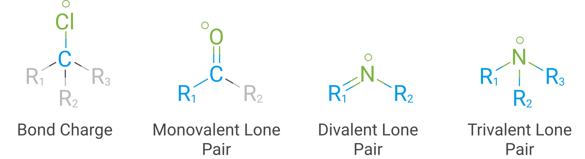
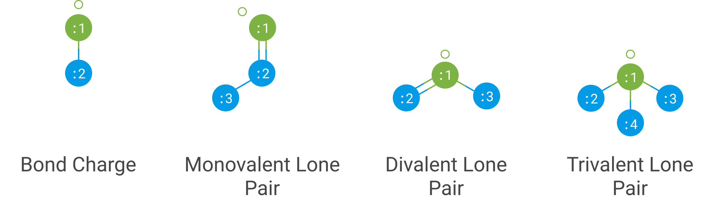
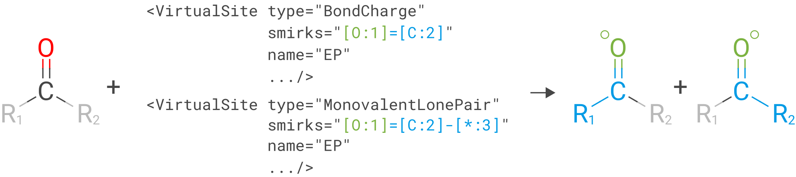
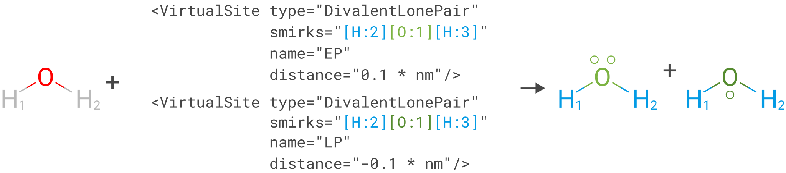

(virtualsites)=
# Virtual sites

The Open Force Field Toolkit fully supports the SMIRNOFF virtual site specification
for models using off-site charges, including 4- and 5-point water models, in
addition to lone pair modelling on various functional groups. The primary focus
is on the ability to add virtual sites to a system as part of system 
parameterization

Virtual sites are treated as massless particles whose positions are computed directly 
from the 3D coordinates of a set of atoms in the parent molecule. The number of atoms that 
are required to define the position will depend on the exact type of virtual site being used 

:::{figure-md} fig-vsite-examples
:align: center
:width: 500px

Examples of each type of virtual site with 'orientation' atoms colored blue and 'parent' 
atoms colored green.
:::

Those atoms used to position the virtual site are referred to as 'orientation' atoms. Further, 
each type of virtual site will denote one of these orientation atoms to be the 'parent', which 
conceptually corresponds to the atom that the virtual site is 'attached to'.

## Applying virtual site parameters

Virtual sites are incorporated into a force field by adding a [VirtualSites tag], which 
specifies both the parameters associated with the different virtual sites and how they 
should be applied to a molecule according to SMARTS-based rules.

As with all parameters in the SMIRNOFF specification, each virtual site parameter has an
associated SMIRKS pattern with a number of atoms tagged with map indices. Each mapped atom
corresponds to one of the atoms used to orientate the virtual site, and for all the 
currently supported types, the atom matched as atom `:1` is denoted the parent.

:::{figure-md} fig-vsite-smirks-to-particle
:align: center
:width: 550px

The mappings between SMIRKS map indices to orientation particle
:::

Virtual site parameters are applied by trying to match every associated SMIRKS pattern with 
the molecule of interest. In cases where multiple parameters *with the same `name`* would 
designate the same atom as a parent (i.e. an atom that a virtual site will be 'attached' to), 
then the last parameter to match will be assigned.

:::{figure-md} fig-vsite-matches
:align: center
:width: 550px

The last parameter to match a particular parent atom wins. Here the monovalent lone parameter 
would be assigned rather than the bond charge parameter as it appears later in the parameter list.
:::

In cases where the same parameter matches the same parent atom multiple times, as is the case 
in the above example of formaldehyde, the value of the `match` keyword will determine the outcome. 

The `"match"` attribute accepts either `"once"` or `"all_permutations"`, offering control for 
situations where a SMARTS pattern can possibly match the same group of atoms in different orders
(either due to wildcards or local symmetry) and it is desired to either add just one or all of the 
possible virtual particles.

  * *`once`* - only one of the possible matches will yield a virtual site being added to the system.
    This keyword is only valid for types virtual site whose coordinates are invariant to the 
    ordering of the orientation atoms, e.g. the trivalent lone pair type, to avoid ambiguity as to 
    which atom ordering to retain.
  * *`all_permutations`* - all the possible matches will yield a virtual site being added to the system,
    such as in the monovalent lone pair example above.
  
If multiple parameters with different names would designate the same atom as a parent then the 
last matched parameter for each value of `name` would be assigned and yield a new virtual site 
being added.

:::{figure-md} fig-vsite-matches-name
:align: center
:width: 550px

Multiple parameters can be used to create virtual sites on the same parent atom by giving them 
different names, e.g. in the case of a TIP6P model.
:::

The following cases exemplify our reasoning in implementing this behavior, and
should draw caution to complex issues that may arise when designing virtual
site parameters. Let us consider 4-, 5-, and 6-point water models:

* A 4-point water model with a `DivalentLonePair`: This can be implemented by
  specifying `match="once"`, `outOfPlaneAngle="0*degree"`, and
  `distance=-.15*angstrom"`. Since the SMIRKS pattern `"[#1:1]-[#8X2:2]-[#1:3]"`
  would match water twice and would create two particles in the exact
  same position if `all_permutations` was specified, we specify `"once"` to
  have only one particle generated. Although having two particles in the same
  position should not affect the physics if the proper exclusion policy is
  applied, it would effectively make the 4-point model just as expensive as
  5-point models.

* A 5-point water model with a `DivalentLonePair`: This can be implemented by
  using `match="all_permutations"` (unlike the 4-point model),
  `outOfPlaneAngle="56.26*degree`, and `distance=0.7*angstrom`, for example.
  Here the permutations will cause particles to be placed at ±56.26 degrees.

* A 6-point water model with both `DivalentLonePair` sites above. Since these
  two parameters look identical, it is unclear whether they should both be
  applied or if one should override the other. The toolkit never compares the
  physical numbers to determine equality as this can lead to instability during
  e.g. parameter fitting. To get this to work, we specify `name="EP1"` for the
  first parameter, and `name="EP2"` for the second parameter. This instructs
  the parameter handler keep them separate, and therefore both are applied.
  If both had the same name, then the typical SMIRNOFF hierarchy rules are
  used, and only the last matched parameter would be applied.

## Ordering of atoms and virtual sites

The toolkit handles the orders the atoms and virtual sites in a topology in a
specific manner for internal convenience.

In addition, due to the fact that a virtual site may contain multiple particles coupled 
to single parameters, the toolkit makes a distinction between a virtual *site*, and a virtual 
*particle*. A virtual site may represent multiple virtual particles, so the total number of 
particles cannot be directly determined by simply summing the number of atoms and virtual
sites in a molecule. This is taken into account, however, and the 
[`Molecule`](openff.toolkit.topology.Molecule) and
[`Topology`](openff.toolkit.topology.Topology) classes both implement `particle`
iterators.

:::{note}
The distinction between a virtual site and virtual particle is due to be removed in a future
version of the toolkit, and a 'virtual site' will simply refer to one massless particle placed
on a parent atom rather than to a collection of massless particles.

## Intramolecular interactions

The virtual site specification allows a [virtual site section] to define the policy 
that should be used to handle intramolecular interactions (exclusions). The toolkit 
currently only supports the `parents` policy as outline in the [virtual site section] 
of the SMIRNOFF specification, which states that each virtual site should inherit their
1-2, 1-3, 1-4, and 1-n exclusions directly from the parent atom.

[VirtualSites tag]: https://openforcefield.github.io/standards/standards/smirnoff/#virtualsites-virtual-sites-for-off-atom-charges
[virtual site section]: https://openforcefield.github.io/standards/standards/smirnoff/#virtualsites-virtual-sites-for-off-atom-charges
